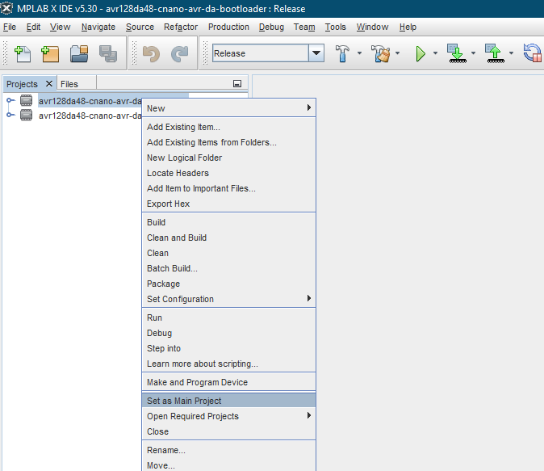
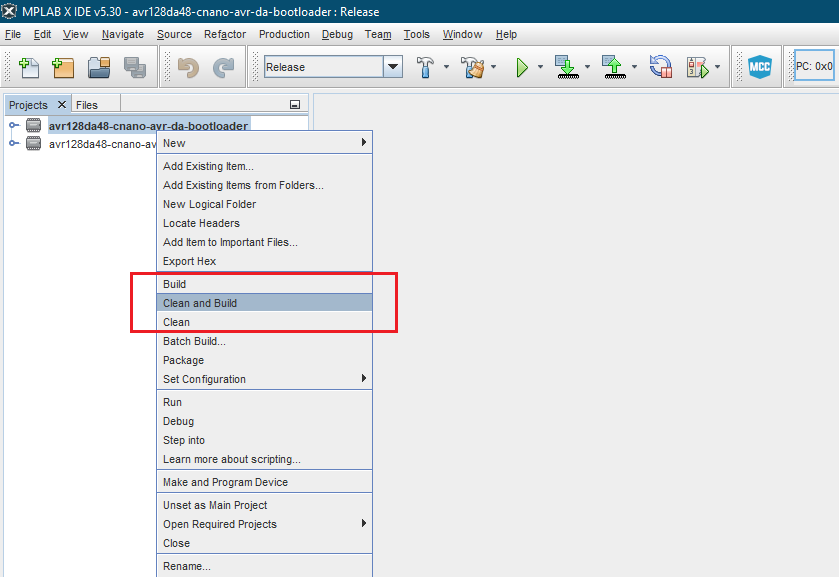
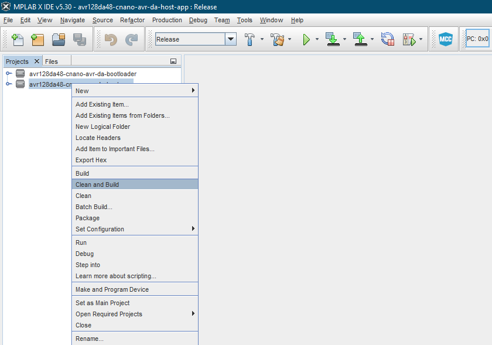

 <article class="markdown-body entry-content p-3 p-md-6" itemprop="This needs to locked down and 'never' changed">

# Basic Bootloader for the AVR-DA Family (MPLAB X)

This repository contains the MPLAB X projects for a basic bootloader compatible with AVR-DA family, a host application and the flashing environment (Python™ scripts) used to upload the application image into the microcontroller's memory, as described in [*AN3341 - Basic Bootloader for the AVR MCU DA (AVR-DA) Family*](https://www.microchip.com/wwwappnotes/appnotes.aspx?appnote=en1001654) Application Note from Microchip.

## Related Documentation
More details and code examples on the AVR128DA48 can be found at the following links:
- [AN3341 - Basic Bootloader for the AVR MCU DA (AVR-DA) Family](https://www.microchip.com/wwwappnotes/appnotes.aspx?appnote=en1001654)
- [AVR128DA48 Product Page](https://www.microchip.com/wwwproducts/en/AVR128DA28)
- [AVR128DA48 Code Examples on GitHub](https://github.com/microchip-pic-avr-examples?q=avr128da48)
- [AVR128DA48 Project Examples in START](https://start.atmel.com/#examples/AVR128DA48CuriosityNano)

## Software Used
- MPLAB® X IDE 5.30 or newer [(microchip.com/mplab/mplab-x-ide)](http://www.microchip.com/mplab/mplab-x-ide)
- AVR-GCC Compiler v5.4.0 [(AVR 8-bit Toolchain v3.62)](https://www.microchip.com/mplab/avr-support/avr-and-arm-toolchains-c-compilers)
- AVR-Dx 1.0.18 or newer Device Pack
- Python™ 3.7.0 or newer [(python.org)](https://www.python.org/)

## Hardware Used
- AVR128DA48 Curiosity Nano [(DM164151)](https://www.microchip.com/Developmenttools/ProductDetails/DM164151)

## Setup
The AVR128DA48 Curiosity Nano Development Board is used as test platform.

## Operation
In order to upload the application image follow this steps:
1. Connect the board to the PC.

2. Check the COM port the AVR128DA48 Curiosity Nano was connected to by opening *Device Manager* in Windows:
 

3. Open in MPLAB X the two projects:
  - avr128da48-cnano-avr-da-bootloader.X
  - avr128da48-cnano-avr-da-host-app.X

4. Set *avr128da48-cnano-avr-da-bootloader* project as main project
 

5. Clean and build the Bootloader project: right click on *avr128da48-cnano-avr-da-bootloader* project and select Clean and Build
 

6. Clean and build the Host App project: right click on *avr128da48-cnano-avr-da-host-app* project and select Clean and Build
 

7. Program *avr128da48-cnano-avr-da-bootloader* project to the board.
 

8. Browse to *scripts* folder and open for editing *SerialUpload.bat* file. The python command has the following format:

`python AVR-DA_uploader.py {path_to_hex_file} {flash_max_size} {COM_port} {baud_rate}`

The parameters are:
  - `{path_to_hex_file}` - path to the executable file to be flashed, including its path
  - `{flash_max_size}` - maximum size of the flash in hexadecimal value
  - `{COM_port}` - the COM port where the AVR128DA48 Curiosity Nano is attached to
  - `{baud_rate}` - the baud rate of the serial communication

Note: For the current implementation, the baud rate for serial communication is configured in code as 9600.

Example:
 

9. Replace {path_to_hex_file}, {flash_max_size}, {COM_port}, {baud_rate} fields with their actual values and save the file.

10. Press SW0 button to make the Bootloader enter in "application flashing mode".

11. Run *SerialUpload.bat*

## Summary
This *AN3341 - Basic Bootloader for the AVR MCU DA (AVR-DA) Family* application note describes how the AVR® MCU DA (AVR-DA) family of microcontrollers (MCUs) can use self-programming. This enables the user to download application code into Flash without the need for an external programmer.
